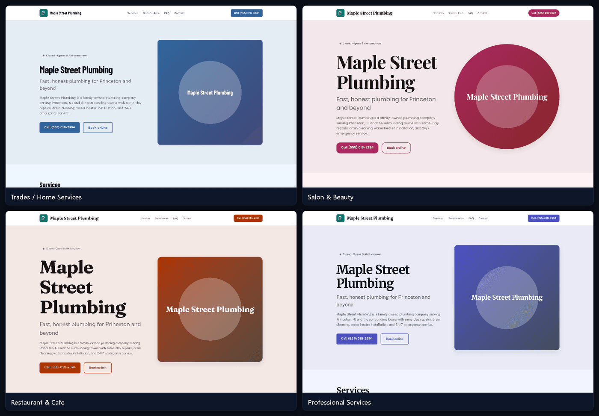
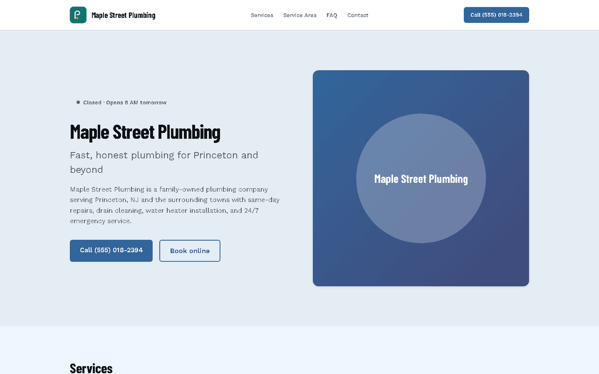
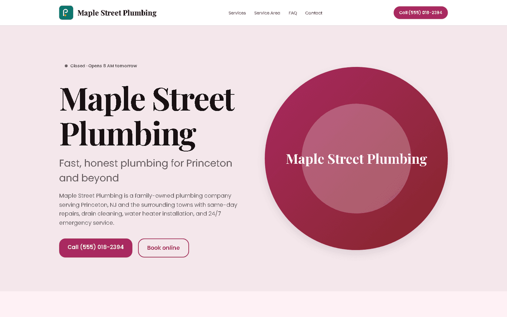
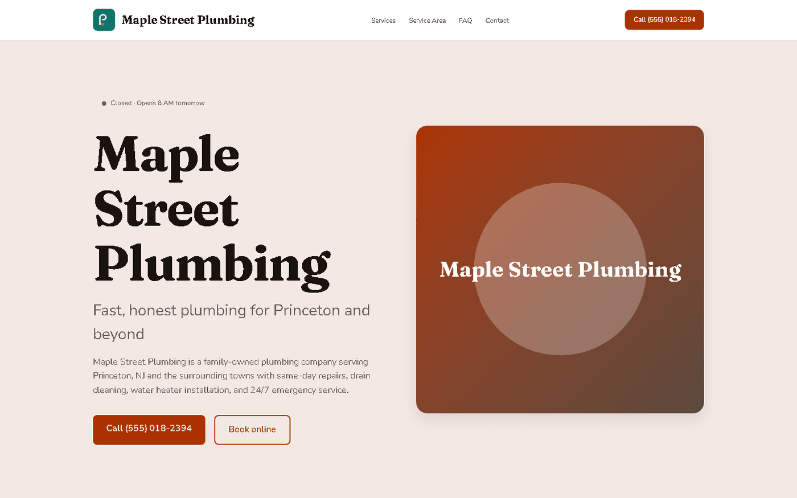
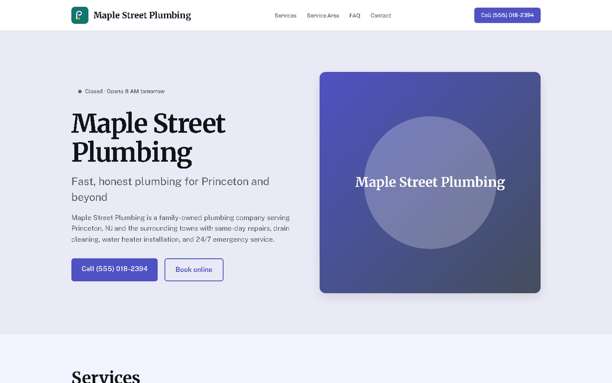
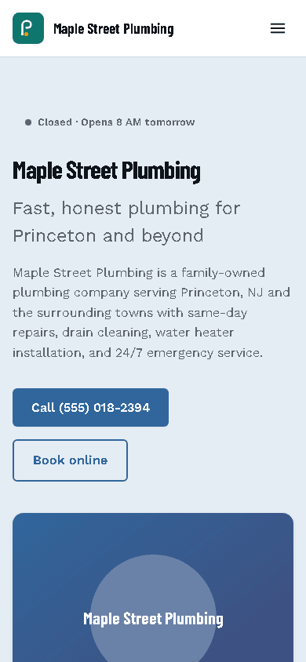
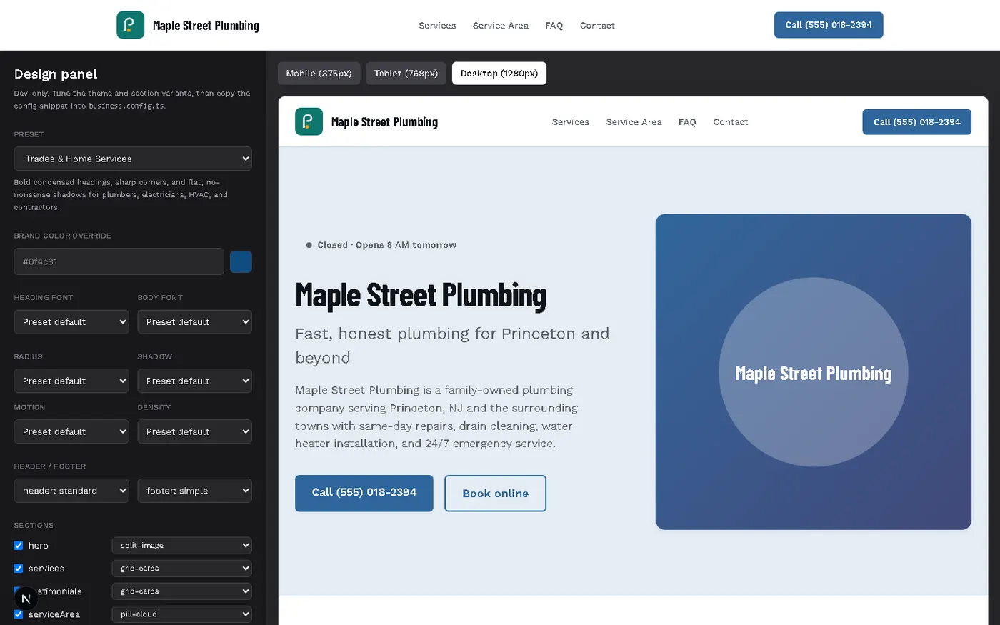

# localbiz-site

[](https://github.com/Ricky1800/localbiz-site/actions/workflows/ci.yml)
[](https://github.com/Ricky1800/localbiz-site/tags)
[](./LICENSE)

A Next.js (App Router) + TypeScript (strict) + Tailwind CSS starter that turns
**one typed config file** into a fast, SEO-ready website for a local
business — a plumber, salon, restaurant, contractor, or anything in between.



[**Live demo**](https://localbiz-site-demo.vercel.app) (the example "Maple Street Plumbing" config) · [**Deploy to Vercel**](https://vercel.com/new/clone?repository-url=https%3A%2F%2Fgithub.com%2FRicky1800%2Flocalbiz-site)

## The problem this solves

Most local businesses (a plumber, a salon, a one-location restaurant) don't
need a CMS, a database, or a page builder subscription — they need a fast,
correct, good-looking site that answers three questions: *are you open right
now, what do you do, and how do I reach you.* Building that from scratch
every time means re-solving the same handful of hard, easy-to-get-wrong
problems: timezone-correct "open now" logic, valid JSON-LD for local search,
and an accessible, mobile-friendly layout.

`localbiz-site` solves it once. You edit `business.config.ts` — a single
typed, validated file — and get a complete, statically-generatable site.
There's no admin panel and no database because there doesn't need to be one:
the config file *is* the CMS, and it's checked into git like everything else.

## Live features

- **A real design system, not a single template.** 8 vertical-tuned theme
  presets, an OKLCH palette generator with automatic WCAG AA contrast
  correction, 2 variants per homepage section, and a live `/design` panel
  (dev only) to tune and copy a config snippet — see "Design system" below.
- **One config file.** `business.config.ts` is validated against a
  [zod](https://zod.dev) schema at build time (`lib/config.ts`) — typos and
  missing fields fail fast with a readable error instead of a broken page.
- **Timezone-correct "open now" status.** `lib/hours.ts` computes whether the
  business is open right now in *its own* timezone (not the visitor's or the
  server's), using the `Intl` API — no date-library dependency. Supports:
  - Multiple ranges per day (e.g. a lunch closure)
  - Overnight ranges that spill past midnight (e.g. a bar open until 2 AM)
  - Fully closed days
  - Holiday / one-off date overrides (closed, or special reduced hours)
  - Daylight Saving Time transitions
- **Statically generated service pages** at `/services/[slug]`, one per
  entry in `business.config.ts`'s `services` array.
- **An optional contact form** on `/contact` that POSTs JSON to a configurable
  webhook URL (Zapier, Make, Formspree, your own endpoint — anything that
  accepts a JSON POST). Leave `contactFormWebhookUrl` unset and the form
  simply doesn't render; phone/email contact still does.
- **JSON-LD structured data** on every page: `LocalBusiness` (mapped to the
  correct schema.org subtype — `Plumber`, `HairSalon`, `Restaurant`, etc.,
  falling back to generic `LocalBusiness`), `openingHoursSpecification`,
  `geo`, `areaServed`, `FAQPage`, and per-service `Service` + `Offer`.
- **Per-page metadata**, canonical URLs, OpenGraph/Twitter cards,
  `app/sitemap.ts`, and `app/robots.ts`.
- **Accessible by default**: skip-to-content link, landmark regions, visible
  focus rings, `prefers-reduced-motion` support, a keyboard-operable mobile
  nav, and a zero-JavaScript `<details>`-based FAQ accordion.
- **Fast by default**: React Server Components everywhere except the three
  places that genuinely need client JS (the mobile nav toggle, the live hours
  widget, and the contact form).

## Screenshots

| Trades / Home Services | Salon & Beauty |
|---|---|
|  |  |

| Restaurant & Cafe | Professional Services |
|---|---|
|  |  |

Mobile (390×844), Trades preset:



All four presets come from the same `business.config.ts` shape — only
`theme.preset` (and the copy) changes. See the [`/design` panel](#live-design-panel---design)
below for switching presets live.

## Tech stack

Next.js (App Router) · TypeScript (strict) · Tailwind CSS · zod · Vitest ·
Playwright + axe-core · Lighthouse CI

## Quickstart

```bash
git clone https://github.com/Ricky1800/localbiz-site.git
cd localbiz-site
npm install
npm run dev
```

Open `http://localhost:3000` — you'll see the example business, **Maple
Street Plumbing** (a fictional business in Princeton, NJ with a placeholder
555 phone number).

## Customize in 10 minutes

1. **Open `business.config.ts`.** This is the only file you need to edit to
   launch your own site.
2. **Replace the identity fields**: `name`, `tagline`, `description`,
   `businessType` (see the config reference below for supported values),
   `address`, `phone`, `email`, `geo` (latitude/longitude — grab these from
   Google Maps: right-click your location → the coordinates are the first
   item in the context menu), and `timezone` (an
   [IANA timezone name](https://en.wikipedia.org/wiki/List_of_tz_database_time_zones),
   e.g. `"America/Chicago"`).
3. **Set your `hours`.** One entry per day, either `{ closed: true }` or
   `{ closed: false, ranges: [{ open: "09:00", close: "17:00" }] }`. Add a
   second range for a lunch break; set `close` earlier than `open` for a
   range that spans midnight.
4. **Add `dateOverrides`** for holidays or one-off schedule changes — see the
   example config for the shape.
5. **Fill in `services`** — each needs a unique `slug` (used in the URL,
   lowercase-kebab-case), a `name`, and a `description`. `priceFrom` is
   optional.
6. **Set `serviceAreas`, `testimonials`, and `faq`** to your own towns,
   reviews, and questions.
7. **Pick a `theme.preset`** matching your vertical (or leave it at
   `"neutral"`), optionally overriding `brandColor` with your own brand hex —
   the whole site re-themes from it. See "Design system" below, or tune it
   live at `/design` and use its "Copy config" button.
8. **Replace `public/logo.svg`** with your own logo, and update `logoPath` if
   you rename the file.
9. **Set `siteUrl`** to your real domain once you have one (it's used to
   build canonical URLs, JSON-LD `@id`s, and the sitemap).
10. **Optionally set `bookingUrl`** (a Calendly/Cal.com link) and
    `contactFormWebhookUrl` (see below) — both are optional and the UI adapts
    automatically when they're unset.

Run `npm run build` once you're done — if `business.config.ts` has a typing
or validation problem, the build will fail with a specific, readable error
telling you exactly which field is wrong.

### Wiring up the contact form

`contactFormWebhookUrl` should point at anything that accepts a JSON `POST`
body of `{ name, email, phone, message }`. This project doesn't include a
backend on purpose — pick whichever of these fits:

- A [Zapier](https://zapier.com) "Catch Hook" trigger
- A [Make.com](https://www.make.com) webhook trigger
- [Formspree](https://formspree.io) or a similar forms-as-a-service endpoint
- Your own serverless function, deployed separately

Leave it unset (`undefined`) to hide the form entirely and rely on
click-to-call / email only.

## Config reference

All fields live in `business.config.ts` and are enforced by the zod schema in
`lib/config.ts`.

| Field | Type | Required | Notes |
|---|---|---|---|
| `name` | `string` | ✅ | Business name. |
| `tagline` | `string` | ✅ | Short one-line pitch, shown in the hero and `<title>`. |
| `businessType` | enum | ✅ | One of the keys in `lib/business-types.ts` (e.g. `"plumber"`, `"hair_salon"`, `"restaurant"`); maps to a schema.org subtype. Use `"other"` to fall back to generic `LocalBusiness`. |
| `description` | `string` | ✅ | Longer description used in metadata and JSON-LD. |
| `address` | object | ✅ | `{ street, city, state, zip, country? }` (`country` defaults to `"US"`). |
| `phone` | `string` | ✅ | Display format; converted to a `tel:` link automatically. |
| `email` | `string` | ✅ | Must be a valid email address. |
| `geo` | object | ✅ | `{ lat, lng }`, used for JSON-LD `GeoCoordinates`. |
| `timezone` | `string` | ✅ | IANA timezone name; validated against the `Intl` API. |
| `hours` | object | ✅ | One entry per day (`mon`…`sun`); see "Customize" above. |
| `dateOverrides` | array | — | Holiday/special-hours overrides; defaults to `[]`. |
| `services` | array | ✅ (min 1) | `{ slug, name, description, priceFrom? }`; slugs must be unique. |
| `serviceAreas` | `string[]` | ✅ (min 1) | Town/city names shown on the homepage and in JSON-LD `areaServed`. |
| `testimonials` | array | — | `{ name, quote, rating?, town? }`; defaults to `[]`. |
| `faq` | array | — | `{ question, answer }`; defaults to `[]`; renders as `FAQPage` JSON-LD when non-empty. |
| `social` | object | — | Any of `facebook`, `instagram`, `google`, `yelp`, `x`, `tiktok`, `linkedin` — full URLs. |
| `bookingUrl` | `string` | — | Calendly/Cal.com link; shows a "Book online" button when set. |
| `contactFormWebhookUrl` | `string` | — | See above; hides the contact form when unset. |
| `theme` | object | — | `{ preset, brandColor?, secondaryColor?, accentColor?, fonts?, radius?, shadow?, motion?, density? }`; defaults to `{ preset: "neutral" }`. See "Design system" below. |
| `sections` | array | — | `{ type, variant }[]` — which homepage sections appear, in what order, and which variant each renders. Defaults to a sensible order (see "Design system"). |
| `layout` | object | — | `{ header: { variant }, footer: { variant } }`. Defaults to `{ header: { variant: "standard" }, footer: { variant: "simple" } }`. |
| `images` | object | — | `{ hero? }` — optional image paths (under `public/`) for section variants that support one (e.g. the hero's `split-image` variant). Unset variants fall back to a token-driven placeholder. |
| `logoPath` | `string` | ✅ | Path under `public/`, e.g. `"/logo.svg"`. |
| `siteUrl` | `string` | ✅ | Full production URL, e.g. `"https://www.example.com"`. |

## Design system

`localbiz-site` isn't a single fixed template — it's a small design system:
a token layer, a set of vertical-tuned presets, and 2 professionally
designed variants per homepage section, all driven by `business.config.ts`
and previewable live in a dev-only panel.

### Presets

Set `theme.preset` to one of the 8 presets below. Each has its own brand
color, Google Fonts pairing (self-hosted via `next/font`), corner-radius
style, shadow style, motion feel, and spacing density.

| Preset | Tuned for | Brand color | Headings / body | Personality |
|---|---|---|---|---|
| `neutral` | Any vertical (default) | `#3457a6` | Inter / Inter | Calm, single-family, safe starting point |
| `salon-beauty` | Hair, nail, day spa | `#b8336a` | Playfair Display / Poppins | Elegant serif, pill controls, generous whitespace |
| `trades-home-services` | Plumbers, electricians, HVAC, contractors, roofers, landscapers, movers | `#0f4c81` | Barlow Condensed / Work Sans | Bold condensed, sharp corners, flat shadows |
| `restaurant-cafe` | Restaurants, cafes, bakeries, bars | `#c2410c` | Fraunces / Nunito Sans | Warm display serif, soft rounded cards |
| `clinic-wellness` | Dentists, physicians, vets, gyms | `#0d9488` | Manrope / IBM Plex Sans | Calm, spacious, legible, rounded |
| `auto-repair` | Auto repair shops | `#b91c1c` | Oswald / Rubik | Industrial condensed, flat, compact |
| `professional-services` | Law firms, accountants, real estate | `#3730a3` | Merriweather / Public Sans | Trustworthy serif over a clean grotesk |
| `boutique-retail` | Florists, pet stores, dry cleaners | `#4d7c0f` | DM Serif Display / DM Sans | Charming display serif, generous rounded cards |

```ts
theme: {
  preset: "restaurant-cafe",
  // Every field below is optional — override only what you want to change
  // from the preset. Omit `theme` entirely to use `{ preset: "neutral" }`.
  brandColor: "#8b2f14",      // re-tint the preset with your own brand color
  secondaryColor: "#2a1b12",
  accentColor: "#d8a13a",
  fonts: { heading: "Fraunces", body: "Work Sans" },
  radius: "lg",               // "none" | "sm" | "md" | "lg" | "pill"
  shadow: "soft",             // "flat" | "soft" | "elevated"
  motion: "standard",         // "subtle" | "standard" | "energetic"
  density: "comfortable",     // "compact" | "comfortable" | "spacious"
},
```

### Tokens

Every color, radius, shadow, type size, and motion duration on the site is a
CSS custom property resolved once per request by `lib/theme/tokens.ts`'s
`resolveTheme()` — no component hard-codes a hex color, a `px` radius, or a
Tailwind gray shade. Those `--t-*` variables are set as an inline style on
`<html>` (`app/layout.tsx`) and mapped onto Tailwind v4's own theme
namespaces in `app/globals.css`'s `@theme inline` block:

- **Color roles**: `bg` / `surface` / `surface-2` / `border` / `fg` /
  `fg-muted`, plus `primary` / `secondary` / `accent` (each with a
  `-foreground` pair) and semantic `success` / `warning` / `danger`. Used as
  `bg-primary`, `text-fg-muted`, `border-border`, etc.
- **Radius & shadow**: override Tailwind's own `--radius-*` / `--shadow-*`
  scale, so existing `rounded-lg` / `shadow-md` utilities automatically
  follow the active preset.
- **Type scale**: a fluid, modular scale (`lib/theme/styles.ts`'s
  `buildTypeScale()`) built from each preset's ratio (1.2–1.333), overriding
  Tailwind's `--text-*` sizes the same way.
- **Motion**: `--t-motion-fast/base/slow` (150–320ms, chosen per preset)
  drive `transition-colors` etc. via Tailwind's `--default-transition-*`.
- **Fonts**: `font-heading` / `font-body` utility classes, backed by
  `next/font/google`-hosted variables (`lib/theme/fonts.ts`).

### Palette generator & accessibility

`lib/theme/color.ts` converts your one `brandColor` hex into
[OKLCH](https://oklch.com), then `lib/theme/palette.ts`'s `generateScale()`
derives a full 11-step (50–950) tonal scale by holding hue fixed and varying
lightness — with gamut-aware chroma reduction so saturated colors don't
silently shift hue when clamped back into sRGB.

Every color-role pairing that renders as text-on-background (body text,
button text, muted text, the accent-colored star rating, ...) is checked
against **WCAG AA** (4.5:1, or 3:1 for large/icon-scale text) by
`resolveTheme()`. A failing pair is nudged (in OKLCH lightness, preserving
hue) until it passes; if a pairing genuinely can't be corrected within a
sane range — e.g. a pastel accent color used as icon/text color — **the
build fails** with a specific error naming the pair and the ratio achieved,
rather than silently shipping inaccessible text. See
`lib/theme/__tests__/color.test.ts`, `palette.test.ts`, and `tokens.test.ts`
for the unit tests covering this (including the failure case).

### Section variants

Each homepage section kind has 2 variants; choose per-section in
`business.config.ts`'s `sections` array (order = render order):

| Section | Variants |
|---|---|
| `header` (in `layout.header`) | `standard` (logo · nav · call button in one row) · `centered` (logo centered, nav below) |
| `hero` | `split-image` (text + photo or a token-driven gradient placeholder) · `centered` (no image, editorial) |
| `services` | `grid-cards` · `list-rows` (numbered menu-style rows) |
| `testimonials` | `grid-cards` · `spotlight` (one large quote + a scroll-snap strip) |
| `serviceArea` | `pill-cloud` · `list-columns` (multi-column with a pin icon) |
| `hoursContact` | `card` (full weekly table + contact) · `banner` (compact single row) |
| `ctaBand` | `simple` (quiet tinted band) · `gradient` (bold brand-gradient band) |
| `faq` | `accordion` (zero-JS `<details>`) · `two-column` (always-expanded cards) |
| `footer` (in `layout.footer`) | `simple` (3-column) · `columns` (4-column, + services + hours) |

All variants are responsive, keyboard-accessible, and built entirely on the
token layer above. `hero`'s `split-image` variant uses `next/image` when
`images.hero` is set, and a tasteful gradient placeholder otherwise.

### Live design panel — `/design`

Run `npm run dev` and open `http://localhost:3000/design` for a live editor:
switch preset, brand color, fonts, radius/shadow/motion/density,
header/footer variant, and each section's enabled state + variant — with an
instant preview at mobile/tablet/desktop widths, a live WCAG contrast
report, and a **"Copy config"** button that renders the exact
`theme`/`sections`/`layout` snippet to paste into `business.config.ts`.



This route is dev-only: `app/design/page.tsx` calls `notFound()` outside
`NODE_ENV=development`, so it 404s in any production build/deployment (this
is verified by `tests/e2e/design-panel.spec.ts`, not just asserted).

### Quality gates

- **Accessibility matrix** (`tests/e2e/a11y.spec.ts`): [Playwright](https://playwright.dev)
  + [`@axe-core/playwright`](https://github.com/dequelabs/axe-core-npm) run
  against `/`, `/contact`, and a `/services/[slug]` page, **for every one of
  the 8 presets** (an `e2e-preset` cookie, honored only when the test server
  is built with `ALLOW_THEME_OVERRIDE=1`, switches presets per-request
  without rebuilding 8 times — see `lib/theme/e2e-override.ts`). Fails on
  any `serious`/`critical` violation.
- **Visual smoke** (`tests/e2e/screenshots.spec.ts`): a full-page screenshot
  per preset, attached to the HTML report — a "does it actually render, with
  the right brand color applied" smoke check, not pixel-diff regression
  (which would be brittle with no committed OS-specific baseline images).
- **`/design` 404 check** (`tests/e2e/design-panel.spec.ts`): confirms the
  panel really 404s in a production build.
- **Lighthouse CI** (`lighthouserc.cjs`): budgets of performance ≥ 90,
  accessibility ≥ 95, SEO ≥ 95, best-practices ≥ 95 against the *default*
  production build (no override) — `npm run lhci`.

```bash
npx playwright install --with-deps chromium   # once, before first run
npm run test:e2e     # Playwright: a11y matrix + visual smoke + /design 404
npm run lhci         # Lighthouse CI budgets
```

All of the above run in CI (`.github/workflows/ci.yml`'s `e2e` and
`lighthouse` jobs), including installing Playwright's browsers.

## How SEO works

- **JSON-LD** is generated from your config at request time by
  `lib/schema-org.ts` and injected via `components/JsonLd.tsx`:
  - A `LocalBusiness` (or the matching subtype) graph on every page, with
    `openingHoursSpecification` built from `hours`, `areaServed` built from
    `serviceAreas`, and an `aggregateRating`/`review` block computed
    automatically when any `testimonials` entries include a `rating`.
  - An `FAQPage` graph on the homepage when `faq` is non-empty.
  - A `Service` graph (with an `Offer` when `priceFrom` is set) on each
    `/services/[slug]` page.
- **Metadata**: every page sets a title (via the root template in
  `app/layout.tsx`), description, canonical URL, and OpenGraph/Twitter tags.
- **`app/sitemap.ts`** enumerates the homepage, `/contact`, and every service
  page. **`app/robots.ts`** allows all crawling and points at the sitemap.
- None of this requires an API key, a Search Console property, or any
  external service — it's all derived from `business.config.ts` at build/
  request time.

## Testing

- **Unit tests** ([Vitest](https://vitest.dev), `lib/**/*.test.ts`): pure
  logic — the hours engine, the config schema, and the JSON-LD builders in
  `lib/__tests__/` (timezones, overnight ranges, closed days, holiday
  overrides, DST transitions), plus the design system's color math, palette
  generator, contrast checker, and section-config schema in
  `lib/theme/__tests__/` and `lib/sections/__tests__/`.
- **End-to-end tests** ([Playwright](https://playwright.dev) +
  [`@axe-core/playwright`](https://github.com/dequelabs/axe-core-npm),
  `tests/e2e/`): an accessibility matrix across every preset, visual smoke
  screenshots, and the `/design` dev-only-404 check — see "Design system" →
  "Quality gates" above for details.
- **Lighthouse CI** (`lighthouserc.cjs`): performance/accessibility/SEO/
  best-practices budgets against the production build.

```bash
npm test                                      # unit tests, once
npm run test:watch                            # unit tests, watch mode

npx playwright install --with-deps chromium   # once, before first e2e run
npm run test:e2e                              # Playwright suite
npm run lhci                                  # Lighthouse CI budgets
```

If Playwright's browsers can't be installed in your environment (no network
access, sandboxed CI, etc.), say so rather than silently skipping — `npm run
test:e2e` will fail clearly at the `npx playwright install` step, not
partway through a test run.

## Scripts

| Command | What it does |
|---|---|
| `npm run dev` | Start the dev server at `http://localhost:3000`. |
| `npm run build` | Production build (also statically generates service pages). |
| `npm start` | Serve the production build. |
| `npm run lint` | ESLint (Next.js core-web-vitals + TypeScript rules). |
| `npm run typecheck` | `tsc --noEmit`. |
| `npm test` | Run the Vitest suite once. |
| `npm run test:e2e` | Run the Playwright suite (a11y matrix, visual smoke, `/design` 404 check). |
| `npm run test:e2e:ui` | Same, with Playwright's interactive UI runner. |
| `npm run lhci` | Run Lighthouse CI against a production build and assert budgets. |

## Roadmap

See [`ROADMAP_ISSUES.md`](./ROADMAP_ISSUES.md) for a set of scoped,
contributor-friendly issues — multi-location support, a blog/announcements
collection, a Playwright accessibility/visual-regression suite, i18n, and
more. Nothing in that list is implemented yet; see it as a backlog, not a
feature list.

## Contributing

See [`CONTRIBUTING.md`](./CONTRIBUTING.md). Bug reports and feature requests
use the templates under `.github/ISSUE_TEMPLATE/`.

## Authors

- [@Ricky1800](https://github.com/Ricky1800)
- [@orbitwebsites-cloud](https://github.com/orbitwebsites-cloud) ([OrbitBoyzz](https://orbitboyzz.me))

## License

[MIT](./LICENSE) © 2026 Ricky1800
